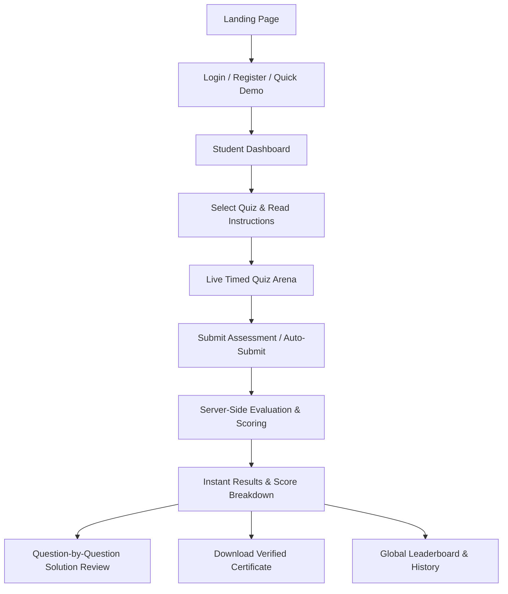

# ⚡ QuizzMaster Pro - Modern Online Quiz & Assessment Platform

A feature-rich, high-performance, and beautifully crafted Online Quiz Web Application designed with modern glassmorphism aesthetics, dark/light themes, procedural Web Audio effects, canvas celebration confetti, and instant result analytics.

---

## 🌟 Key Features

### 1. 🔐 User Registration & Authentication
- **Dual Roles**: Supports both **Student** and **Administrator** accounts.
- **Persistent Sessions**: User authentication state and test records are preserved in `localStorage`.
- **Avatar Selection**: Choose from unique avatar emojis on signup.
- **1-Click Quick Demo Access**: Instantly test as **Student (Alex)** or **Admin (Dr. Sarah)**.

### 2. 📚 Comprehensive Quiz Categories
- **☕ Java Programming**: OOP concepts, JVM architecture, access modifiers, constructors, exception handling, collections, and multi-threading.
- **🌐 General Knowledge**: World geography, history, inventions, records, and astronomy.
- **📐 Mathematics & Aptitude**: Algebra, percentages, probability, speed-distance-time, geometric series.
- **🔬 General Science & Tech**: Physics laws, chemical formulas, biology cell theory, optics.
- **📚 English Grammar**: Sentence correction, subject-verb agreement, idioms, parts of speech, vocabulary.

### 3. ⏱️ Live Quiz Arena Engine
- **Countdown Timer**: High-accuracy delta countdown timer with visual warning animation under 60 seconds.
- **Automatic Submission**: Automatically calculates and submits the test when the timer expires.
- **Question Navigation Palette**: Jump directly to any question with color-coded states:
  - 🟢 **Answered**
  - ⚪ **Unanswered**
  - 🟡 **Marked for Review**
  - 🔵 **Current Question**
- **Action Controls**: Previous, Next, Clear Selection, Mark/Unmark for Review.
- **Keyboard Shortcuts**: Press keys `1`, `2`, `3`, `4` to pick options, and `ArrowLeft` / `ArrowRight` to navigate.

### 4. 📊 Instant Results & Answer Breakdown
- **Animated Circular Score Gauge**: Real-time score percentage and marks fraction display.
- **Pass / Fail Determination**: Dynamic grading based on individual quiz pass criteria.
- **Performance Metrics**: Total questions, correct count, wrong count, accuracy percentage, and time spent.
- **Full Solution Review**: Question-by-question review showing:
  - Your selected option vs correct option highlighted in emerald green.
  - In-depth explanation / pedagogical notes for every question.
- **Celebration Confetti**: Physics-based canvas confetti burst on passing score.
- **Sound Effects**: Procedural Web Audio API sound cues for timer ticks, option select, correct answers, and fanfares (with mute toggle).

### 5. 🎓 Downloadable Verified Certificate
- Built-in HTML5 Canvas certificate generator that dynamically renders the student's name, quiz title, score, date, and verified certificate ID.
- One-click high-resolution PNG download and print support.

### 6. 🏆 Global & Category Leaderboards
- Real-time aggregation of top-performing scholars.
- **Top 3 Podium**: Gold (👑 1st), Silver (2nd), and Bronze (3rd) rankings.
- Filter rankings by **All Categories** or specific subjects.

### 7. 📜 Attempt History Tracker
- Log of all previous test attempts with dates, scores, time spent, and pass/fail badges.
- One-click **Review** button to revisit the question breakdown of any previous attempt.

### 8. ⚙️ Full Administrative Control Center
- **Quiz Catalog Management**: Add, edit, or delete quizzes; configure duration, difficulty, passing score, category, and icon.
- **Question Manager**: Add/Edit/Delete individual multiple-choice questions, set marks, configure options, and write explanations.
- **📤 Bulk Question Importer**: 1-click bulk upload of questions via **CSV**, **JSON**, or copy-pasted **Formatted Text / AI Prompts** (from ChatGPT / Word) with live preview and validation.
- **📥 Sample Question Templates**: Instant download of sample CSV and JSON question templates.
- **📊 Student Score Sheets (CSV Export)**: Export full examination records with student details, scores, percentages, and timestamps.
- **📄 Printable Class Assessment & Performance Reports (PDF)**: Clean, branded assessment summaries with pass rates, subject breakdown, and full student scoresheet ready for printing or saving as PDF.
- **Student Submissions Inspector**: Search and filter all student attempts across the platform.
- **Category Analytics**: Pass rates and average accuracy across categories.
- **Data Backup & Restore**: Export platform database as JSON, import from backup file, or reset to factory defaults.

---

## 📁 Project Structure

```
new project/
├── index.html                    # Master Single Page Application layout & view templates
├── README.md                     # Comprehensive documentation & setup manual
├── css/
│   ├── style.css                 # Design tokens, variables, typography, reset, scrollbar
│   ├── components.css            # Buttons, glass cards, badges, modals, toasts, inputs
│   └── views.css                 # Hero, Auth, Dashboard, Quiz arena, Results, Admin views
└── js/
    ├── data/
    │   ├── defaultQuizzes.js     # Preloaded 50+ question library across 5 subjects
    │   └── defaultUsers.js       # Demo student & admin accounts with seed attempts
    ├── services/
    │   ├── storage.js            # LocalStorage abstraction, queries, bulk save, and backup/restore
    │   ├── api.js                # REST API client with bulk questions and CSV endpoints
    │   └── auth.js               # Sign up, sign in, role management, session broadcast
    ├── components/
    │   ├── timer.js              # High-accuracy countdown timer with callbacks
    │   ├── sound.js              # Web Audio API sound synthesizer
    │   ├── confetti.js           # Celebration particle confetti canvas engine
    │   └── certificate.js        # Canvas certificate renderer and PNG exporter
    ├── admin.js                  # Admin controller, Bulk Importer, CRUD, CSV/PDF reports & analytics
    └── app.js                    # Main SPA router, quiz engine, results & history
```

---

## 🚀 How to Run Locally

### Option 1: Start Node.js Express REST Backend Server (Recommended)
Install dependencies and run the unified server (serving both REST API endpoints and web app):
```bash
npm install
npm start
```
Then open `http://localhost:3000` in your web browser.

### Option 2: Live Development Server (Auto-Reload)
```bash
npm run dev
```

### Option 3: Standalone Browser Mode
Simply open `index.html` directly in Chrome, Edge, Firefox, or Safari.

---

## 🔌 REST API Endpoints

### 🔐 Authentication (`/api/auth`)
| Method | Endpoint | Description |
| :--- | :--- | :--- |
| `POST` | `/api/auth/register` | Register a new student or admin account |
| `POST` | `/api/auth/login` | Authenticate with email & password, returns JWT token |
| `POST` | `/api/auth/demo` | Quick 1-click login for demo student or admin |
| `GET` | `/api/auth/me` | Fetch currently authenticated user profile |
| `PUT` | `/api/auth/profile` | Update profile details and change password |

### 📚 Quizzes (`/api/quizzes`)
| Method | Endpoint | Description |
| :--- | :--- | :--- |
| `GET` | `/api/quizzes` | List all quizzes with optional `?category=` and `?search=` |
| `GET` | `/api/quizzes/:id` | Get quiz metadata and question pool |
| `POST` | `/api/quizzes/:id/unlock` | Validate password for protected tests |
| `POST` | `/api/quizzes` | Create a new quiz *(Admin only)* |
| `PUT` | `/api/quizzes/:id` | Update quiz settings & pass criteria *(Admin only)* |
| `DELETE` | `/api/quizzes/:id` | Delete quiz *(Admin only)* |

### ❓ Questions (`/api/quizzes/:id/questions`)
| Method | Endpoint | Description |
| :--- | :--- | :--- |
| `GET` | `/api/quizzes/:id/questions` | List questions for a quiz |
| `POST` | `/api/quizzes/:id/questions` | Add a new question to quiz *(Admin only)* |
| `POST` | `/api/quizzes/:id/questions/bulk` | **Bulk import questions** via array with append/replace mode *(Admin only)* |
| `PUT` | `/api/quizzes/:id/questions/:index` | Edit question by index *(Admin only)* |
| `DELETE` | `/api/quizzes/:id/questions/:index` | Delete question by index *(Admin only)* |

### 📝 Attempts & Grading (`/api/attempts`)
| Method | Endpoint | Description |
| :--- | :--- | :--- |
| `POST` | `/api/attempts` | **Server-Side Grading** - evaluates submitted answers, computes marks, and saves record |
| `GET` | `/api/attempts` | Get attempt history for logged-in user (or all for Admin) |
| `GET` | `/api/attempts/:id` | Get full attempt evaluation details and explanations |

### 🏆 Leaderboard & Admin (`/api/leaderboard` & `/api/admin`)
| Method | Endpoint | Description |
| :--- | :--- | :--- |
| `GET` | `/api/leaderboard` | Get ranked leaderboard with optional `?category=` filter |
| `GET` | `/api/admin/metrics` | Aggregate platform statistics *(Admin only)* |
| `GET` | `/api/admin/submissions/export-csv` | Download complete student submissions score sheet as CSV *(Admin only)* |
  | `GET` | `/api/admin/export` | Download full platform database JSON backup *(Admin only)* |
| `POST` | `/api/admin/import` | Restore platform database from JSON backup *(Admin only)* |
| `POST` | `/api/admin/reset` | Reset database to factory seed defaults *(Admin only)* |

---

## 🔑 Default Credentials for Instant Testing

| Role | Email | Password | Or Quick Access |
| :--- | :--- | :--- | :--- |
| **Student** | `student@quiz.com` | `student123` | Click **"Student (Alex)"** on Login page |
| **Admin** | `admin@quiz.com` | `admin123` | Click **"Admin (Dr. Sarah)"** on Login page |

---

## 🛠️ Step-by-Step User Flow


